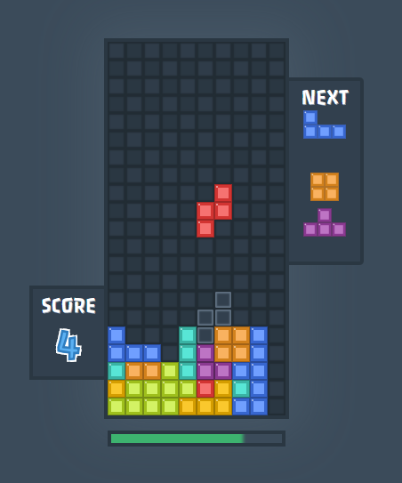

# React-game-tetris 

> The interpretation of the classic game "_Tetris_" in React+Redux

## Play

[ [>> **Play online** <<](https://avin.github.io/react-game-tetris) ]

:construction: :construction: :construction: **Under Construction** :construction: :construction: :construction:

## Another games

Also check my another react+redux games
* [Snake](https://github.com/avin/react-game-snake/)
* [15 puzzle](https://avin.github.io/react-game15/)

## License

MIT © [avin](https://github.com/avin)

